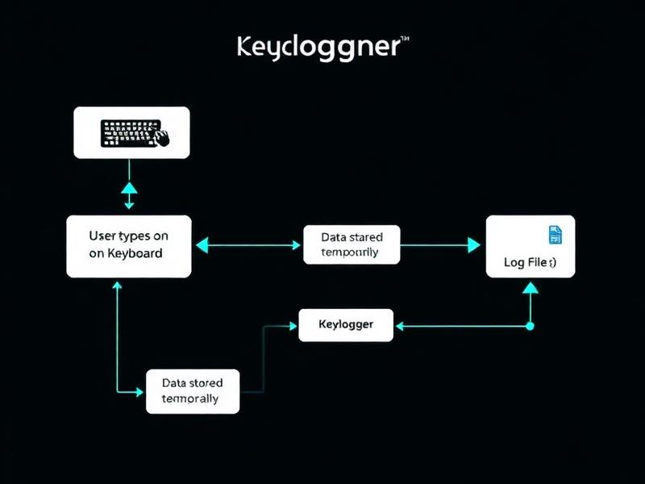

# 🛡️ Keylogger Guardian

A comprehensive educational web application designed to help users understand, prevent, and recover from keylogger threats. Built with modern web technologies to provide an interactive learning experience about cybersecurity.



## 🌟 Features

### 📚 Educational Content
- **What is a Keylogger?** - Comprehensive introduction to keylogger fundamentals and types
- **How It Spreads** - Learn about common distribution methods and attack vectors
- **Prevention Strategies** - Essential security measures and best practices
- **Recovery Guide** - Step-by-step instructions for incident response and system cleanup
- **Risk Assessment** - Interactive tools to evaluate your security posture

### 🎮 Interactive Components
- **Keylogger Simulation** - Safe, educational demonstration of how keyloggers work
- **Security Quiz** - Test your knowledge with interactive questions
- **Real-time Risk Assessment** - Personalized security recommendations

### 🎨 Modern UI/UX
- Responsive design that works on all devices
- Dark/light theme support
- Intuitive navigation with React Router
- Professional UI components with shadcn/ui
- Smooth animations and transitions

## 🚀 Quick Start

### Prerequisites
- Node.js (v18 or higher)
- npm or Bun package manager

### Installation

1. **Clone the repository**
   ```bash
   git clone <YOUR_GIT_URL>
   cd keylogger-guardian
   ```

2. **Install dependencies**
   ```bash
   npm install
   # or
   bun install
   ```

3. **Start the development server**
   ```bash
   npm run dev
   # or
   bun run dev
   ```

4. **Open your browser**
   Navigate to `http://localhost:5173` to view the application.

## 🛠️ Tech Stack

### Frontend Framework
- **React 18** - Modern React with hooks and concurrent features
- **TypeScript** - Type-safe development experience
- **Vite** - Fast build tool and development server

### UI/UX
- **Tailwind CSS** - Utility-first CSS framework
- **shadcn/ui** - High-quality, accessible React components
- **Radix UI** - Unstyled, accessible UI primitives
- **Lucide React** - Beautiful, customizable SVG icons

### State Management & Data
- **TanStack Query** - Powerful data synchronization for React
- **React Hook Form** - Performant forms with easy validation
- **Zod** - TypeScript-first schema validation

### Navigation & Routing
- **React Router** - Declarative routing for React applications

## 📁 Project Structure

```
keylogger-guardian/
├── public/                 # Static assets
│   ├── favicon.ico
│   └── robots.txt
├── src/
│   ├── components/         # Reusable React components
│   │   ├── ui/            # shadcn/ui components
│   │   ├── KeyloggerSimulation.tsx
│   │   └── SecurityQuiz.tsx
│   ├── pages/             # Route components
│   │   ├── Index.tsx      # Home page
│   │   ├── WhatIsKeylogger.tsx
│   │   ├── HowItSpreads.tsx
│   │   ├── Prevention.tsx
│   │   ├── Recovery.tsx
│   │   └── RiskAssessment.tsx
│   ├── hooks/             # Custom React hooks
│   ├── lib/               # Utility functions
│   └── assets/            # Images and media files
├── package.json
├── tailwind.config.ts
├── tsconfig.json
└── vite.config.ts
```

## 🎯 Available Pages

| Route | Component | Description |
|-------|-----------|-------------|
| `/` | Index | Home page with overview and navigation |
| `/what-is-keylogger` | WhatIsKeylogger | Keylogger fundamentals and types |
| `/how-it-spreads` | HowItSpreads | Distribution methods and attack vectors |
| `/prevention` | Prevention | Security measures and best practices |
| `/recovery` | Recovery | Incident response and cleanup guide |
| `/risk-assessment` | RiskAssessment | Interactive security assessment |

## 🎮 Interactive Components

### Keylogger Simulation
A safe, educational component that demonstrates how keyloggers capture input without actually logging any real data. Perfect for understanding the threat in a controlled environment.

### Security Quiz
Interactive quiz component that tests users' knowledge about keyloggers, cybersecurity best practices, and threat prevention.

## 🔧 Development

### Available Scripts

```bash
# Development server with hot reload
npm run dev

# Build for production
npm run build

# Build for development (with source maps)
npm run build:dev

# Lint code
npm run lint

# Preview production build
npm run preview
```

### Code Quality

- **ESLint** - Code linting and formatting
- **TypeScript** - Static type checking
- **Prettier** - Code formatting (configured via ESLint)

### Component Library

This project uses shadcn/ui components, which provide:
- ✅ Accessible by default
- 🎨 Customizable with Tailwind CSS
- 📱 Mobile-responsive
- 🔧 Copy-paste friendly

## 🌐 Deployment

### Using Lovable Platform
1. Visit your [Lovable Project](https://lovable.dev/projects/0ee71ce0-d0d1-4fbd-9ca2-cc0b49290f42)
2. Click on Share → Publish
3. Your app will be deployed automatically

### Manual Deployment
1. Build the project: `npm run build`
2. Deploy the `dist` folder to your hosting platform
3. Configure your server to serve `index.html` for all routes (SPA routing)

### Supported Platforms
- Vercel
- Netlify
- GitHub Pages
- Firebase Hosting
- Any static hosting service

### Custom Domain Setup
To connect a custom domain, navigate to Project > Settings > Domains and click Connect Domain.
Read more: [Setting up a custom domain](https://docs.lovable.dev/tips-tricks/custom-domain#step-by-step-guide)

## 🤝 Contributing

1. Fork the repository
2. Create a feature branch (`git checkout -b feature/amazing-feature`)
3. Commit your changes (`git commit -m 'Add amazing feature'`)
4. Push to the branch (`git push origin feature/amazing-feature`)
5. Open a Pull Request

## 📝 License

This project is licensed under the MIT License - see the [LICENSE](LICENSE) file for details.

## 🔒 Security Notice

This application is designed for educational purposes only. The keylogger simulation component does not actually capture or store any user input. All demonstrations are safe and contained within the application.

## 🆘 Support

If you encounter any issues or have questions:

1. Check the [Issues](https://github.com/your-username/keylogger-guardian/issues) page
2. Create a new issue with detailed information
3. Join our community discussions

## 📊 Browser Support

- ✅ Chrome (latest)
- ✅ Firefox (latest)
- ✅ Safari (latest)
- ✅ Edge (latest)

## 🔄 Updates

This project is actively maintained. Check the [Releases](https://github.com/your-username/keylogger-guardian/releases) page for the latest updates and features.

**Built with ❤️ for cybersecurity education**

*Stay safe, stay informed, stay protected!*
